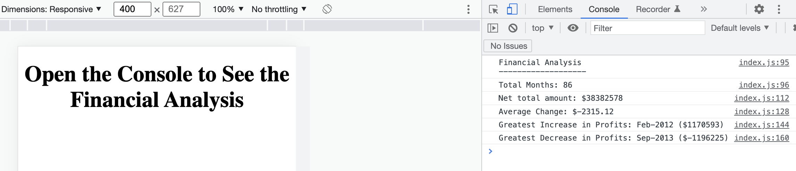

# Console-Finances
In this activity using basic JavaScript skills to create a financial analysis tool.

## Links

https://helloseva.github.io/cCnsole-Finances/

## Description 

This activity has been done as a part of the bootcamp's weekly challenge. In this activity using basic JavaScript skills I created a financial analysis tool using the provided financial dataset. The task was to write JavaScript code that analyzes the records to calculate each of the following:

- The total number of months included in the dataset.
- The net total amount of Profit/Losses over the entire period.
- The average of the changes in Profit/Losses over the entire period.
- The greatest increase in profits (date and amount) over the entire period.
- The greatest decrease in losses (date and amount) over the entire period.

You need to open the console to see the results since the final code prints the analysis to the console.

## Table of Contents (Optional)

* [Installation]
* [Usage]
* [License]

## Installation

1. Go To https://github.com/helloseva/Console-Finances 
2. Copy the Git clone link using SSH.
3. In terminal on your local device, clone the repository using Git clone.
4. Open in Visual Studio.

## Usage 

This page is about using basic JavaScript skills to create a financial analysis tool. It can be used to have a look at basic concepts of JS. 

Screeshot of the Web Page:

## Credits

N/A

## License

Please refer to the LICENSE in the repo.
